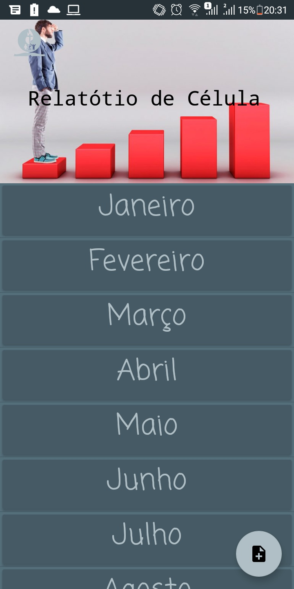
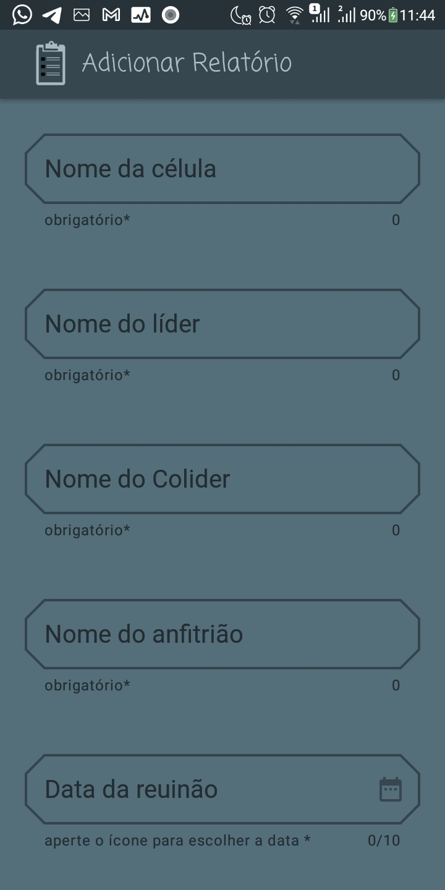
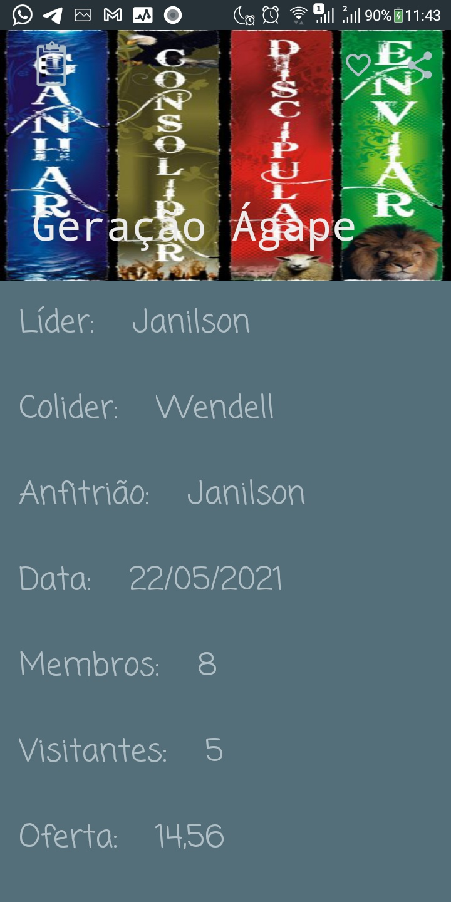

# ReportApp
This App was developed to make report of _Célula_ (religious meeting) registring some required information about this meeting and informing to the church how it was as well. The informations required to make a report is the name of Leader meeting, the name of house owner (usually this meeting is at a member's home), the meeting date, de number of members and somethings else.

---

# SnapShots of the Application.

---

# Adroid APK
Android apk exemple to test the App can be dowloaded [here](./exemple/app-debug.apk)

--
# Licence
Copyright 2017 The Android Open Source Project, Inc.

Licensed to the Apache Software Foundation (ASF) under one or more contributor
license agreements.  See the NOTICE file distributed with this work for
additional information regarding copyright ownership.  The ASF licenses this
file to you under the Apache License, Version 2.0 (the "License"); you may not
use this file except in compliance with the License.  You may obtain a copy of
the License at

http://www.apache.org/licenses/LICENSE-2.0

Unless required by applicable law or agreed to in writing, software
distributed under the License is distributed on an "AS IS" BASIS, WITHOUT
WARRANTIES OR CONDITIONS OF ANY KIND, either express or implied.  See the
License for the specific language governing permissions and limitations under
the License.

---
# Found me

- Email: j.janilson12@gmail.com
- Linkedin : https://www.linkedin.com/in/janilsonalfser

